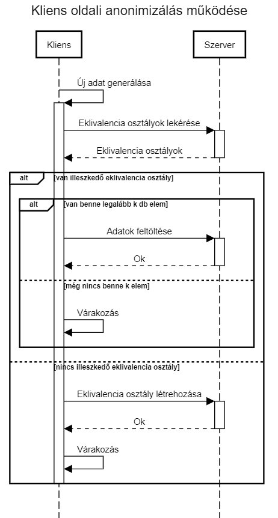

# Folyamatosan érkező adatok kliens oldali anonimizálása

## A folyamatos anonimizálás alapkoncepciója
A legtöbb ma létező anonimizálási megoldás a keletkező adatokat eredeti formájukban, anonimizálatlan formában gyűjti egy központi szerveren, ahol bizonyos idő elteltével vagy bizonyos mennyiségű adat összegyűjtése után végzik el az anonimizálást. Ennek legnagyobb veszélye, hogy az anonimizálás előtti időszakban a tárolt személyes adatok (az egyértelmű azonosítók és a hozzájuk tartozó szenzitív adatok) nem megfelelő védelem esetén illetéktelen kezekbe kerülhatnek. Erre a problémára nyújt megoldást a folyamatos anonimizálás, melynek során a szerverre beérkező adatok eredeti formájukban nem kerülnek tárolásra, hanem a szerver minden beérkezó adatot egyesével (vagy kis csoportokban) anonimizál, és az adatbázisba már csak az így anonimizált adatok kerülnek mentésre. Ezáltal még ha az adatbázishoz valaki hozzá is fér, akkor is csak az algoritmus által alkalmazott anonimizálási kritériumnak (pl.: k-anonimitás) megfelelő adatokat szerezhet meg.

## A kliens oldali anonimizálás előnyei
A fenti koncepció hátránya, hogy az adatok felküldésekor a szerver továbbra is hozzáfér a még anonimizálatlan adatokhoz, ami pedig maga után vonja azt is, hogy az anonimizálást végző félnek továbbra meg kell felelnie a
GDPR által előírt követelményeknek. Ezen kívül teljes bizalom szükséges a kliens és a szerver között,, hiszen egy rosszindulatú szerver például titokban eltárolhatná a felküldött adatokhoz tartozó egyértelmű azonosítókat is. Ennek kiküszöbölésére érdemes megalkotni egy olyan algoritmust, amely lehetővé teszi a kliens (ahol az adat generálódik) számára azt, hogy a saját adatait már helyben anonimizálja, és csak ezután küldje fel őket a szerverre. Ezáltal a kliens teljes biztonságban tudhatja felküldött adatait, és a szerver sem lép interakcióba személyes adatokkal, így annak üzemeltetője mentesül a GDPR előírásai alól. A szerveren így eltárolt adatok később akár szabadon publikálhatóak, hiszen nem tartalmaznak személyes információt.

## Az alkalmazásban használt alapfogalmak
### Adathalmaz (dataset)
Az alkalmazás párhuzamosan több adathalmaz anonimizálását és tárolását támogatja. Egy adathalmazhoz tartozó adatokat egy dataset fogja össze. Adathalmaz szinten állíthatók be az anonimizálási paraméterek (erről később), valamint az adathalmaz létrehozásakor adhatjuk meg annak sémáját, azaz a benne található attribútumokat és azok típusait. Az adathalmaz sémája később új attribútumok felvételével tovább bővíthető.

### Attribútumok
Az alkalmazás különböző típusú mezőket (attribútumokat) kezel. Egy attribútum besorolása a megfelelő kategóriába tervezői döntés, melyet az szerver oldali adatbázis (a programban dataset) sémájának meghatározásakor kell megadni. Az alkalmazás az alábbi típusú attribútumokat különbözteti meg:
* **Egyértelmű azonosító:** Egy adott személy kizárólagos tulajdonsága; olyan adat, mely e személy kilétét egyértelműen meghatározza (pl. név, személyi igazolvány szám). Ezek az anonimzzálás során eltávolításra kerüklnek. A dataset létrehozásakor szerver oldali anonimizálás esetén az egyértelmű azonosítóknak **drop** módot adjunk meg, kliens oldali anonimizáláskor pedig ne küdjük fel ezeket az attribútumokat
* **Kvázi azonosító:** Olyan adat, mely önmagában nem, más információkkal közösen viszont már képes egy adott személy egyértelmű azonosítására (pl.születési idő, irányítószám). Kvázi azonosítók esetén a rendszer különböző adattípusokat támogat. 
    * **Intervallum attribútum:** Jelenleg a szám típusú kvázi azonosítók intervallum attribútumként adhatóak meg, ekkor az adott mező beállításához a **int** módot használhatjuk. Az intervallum attribútumok az intervallum méretének csökkentésével finomíthatóak, ezáltal az adathalmaz információtartalma és hasznossága növelhető. Ilyen intervallum attribútum például az életkor, a fizetés vagy a súly. 
    * **Kategorikus attribútum:** A szöveges attribútumok megadása kategorikus attribútumként történik, melyek definiálásához a **cat** módot kell megadni. A kategirikus attribútumok (a jelenlegi implementációban) nem finomíthatóak, ezekre példa a lakóhely települése vagy a nem.
* **Szenzitív adat:** Egy adott személyről érzékeny információt hordozó ismertető (pl. betegség, politikai nézetek). Mivel az adathalmaz lényegét ezek a szenzitív adatok adják, így ezek eredeti formájukban kerülnek bele az anonimizált adatbázisba. Definiálásukhoz a **keep** módot használhatjuk.

### K-anonimitás
Egy anonimizált adatbázisról akkor mondjuk, hogy k-anonim, ha a benne található kvázi azonosító értékek bármely konkrét előfordulása esetén van még legalább k-1 db rekord, melyben ugyanazok a kvázi azonosító értékek fordulnak elő. Azaz bármely rekordhoz van még k-1 db hasonló rekord, abban az értelemben, hogy a kvázi azonosító értékeik megegyeznek.

### Eklivalencia osztály
A fent megadott k-anonimitás definícióban az azonos attribútum értékekkel rendelkező rekordok egy eklivalencia osztályt alkotnak. Ekkor külön eklivalencia osztályt határoznak meg az adatbázis sémájában található kvázi azonosítók lehetséges értékeinek kombinációi. 
Például az alábbi 2-anonim adatbázisban (amennyiben az életkort és a nemet tekintjük kvázi azonosítónak) eklivalencia osztályt alkoznak az 1.-2., a 3.-4 és az 5.-6. rekordok.

Életkor | Nem | Tesztpontszám 
------------ | ------------- | -------------
12 | Férfi | 79
12 | Férfi | 98
13 | Nő | 99
13 | Nő | 99 
14 | Férfi | 82
14 | Férfi | 85

Egy k-anonim adatbázisban minden eklivalencia osztály számossága legalább k.

## Az algoritmus működése
Az algirutmos célja egy olyan adatbázis építése szerver oldalon, melyben minden eklivalencia osztály legalább k-elemet tartalmaz. Ezáltal az adatbázis k-anonimitása minden pillanatban garantált lesz. Kliens oldali anonimizálás esetén a klienseket önálló ágenseknek tekintjük, melyek adatokat gyűjtenek. Amennyiben a kliensek rendelkezésre áll felküldendő adat, megpróbálja azt elhelyezni a szerveren található eklivalencia osztályok valamelyikében. Ehhez először lekérdezi a szerveren található eklivalenci osztályokat, majd megnézi, hogy az anonimizálandó adatot beleillik-e valamelyik osztályba. 
* Amennyiben talál olyan eklivalencia osztályt, melyben már van legalább k db elem, akkor egyszerűen abba az osztályba kell feltöltenie a keletkezett szenzitív adatokat. Ezt a kiválasztott eklivalencia osztály egyedi azonosítójának megadásával és a szenzitív adatok feltöltésével teszi meg.
* Ha a kliens talál egy olyan eklivalencia osztály, ami illeszkedik a feltöltendő adataira, de abban még nincs legalább k db elem (ekkor ténylegesen még 0 elem lesz az adott eklivalencia osztályba feltöltve, hiszen különben sérülne a k-anonimitás feltétele), akkor a feltöltéssel várnia kell. A kliens jelzi a szervernek a feltöltési igényét (az eklivalencia osztály azonosítójának megadásával), a szerver pedig minden eklivalencia osztályhoz nyilvántartja a feltöltési igények számát. Amennyiben az igények száma valamely osztálynál eléri a k értéket, akkor a szerver jelzi a klienseknek (erről részletesebben később), hogy megkezdhetik a feltöltést, akik erre egyszerre feltöltik az adataikat az eklivalencia osztályba, ahol ennek hatására már legalább k db elem lesz.
* Ha a kliens által generált adatokra egyetlen eklivalencia osztály sem illeszkedik, akkor a kliens generál egyet, és azt (az érzékeny adatk nélkül) felküldi a szerverre. Ilyenkor a szerver menti az eklivalencia osztályt, és a feltöltési igények számát 1-re állítja (az azt létrehozó kliens biztos akar adatot küldeni). Ezután a kliens az előző esethez hasonlóan addig vár, amígy legalább k darab feltöltési igény össze nem gyűlik.

## Az működés részletei

TODO:
* Eklivalencia osztályok finomítása (felmerülő problémák)
* Központi tábla (epszilon érték)
* EO generálás

## Konfigurációs lehetőségek

## A kliens működése